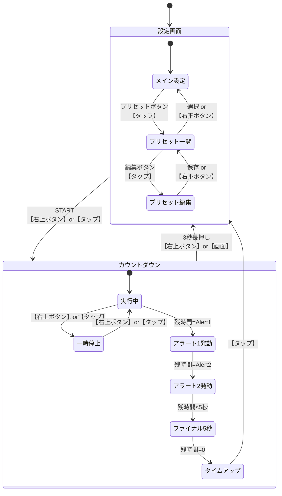
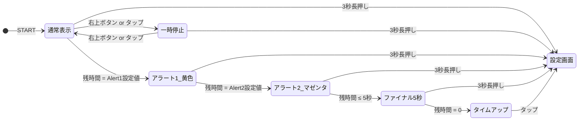
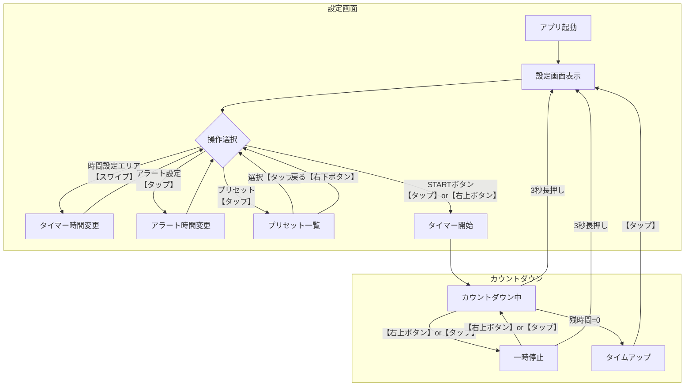
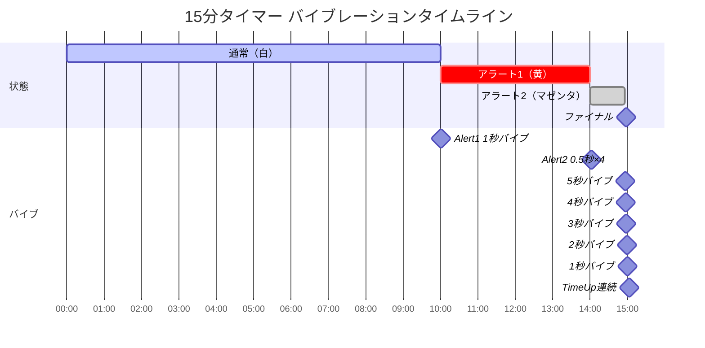
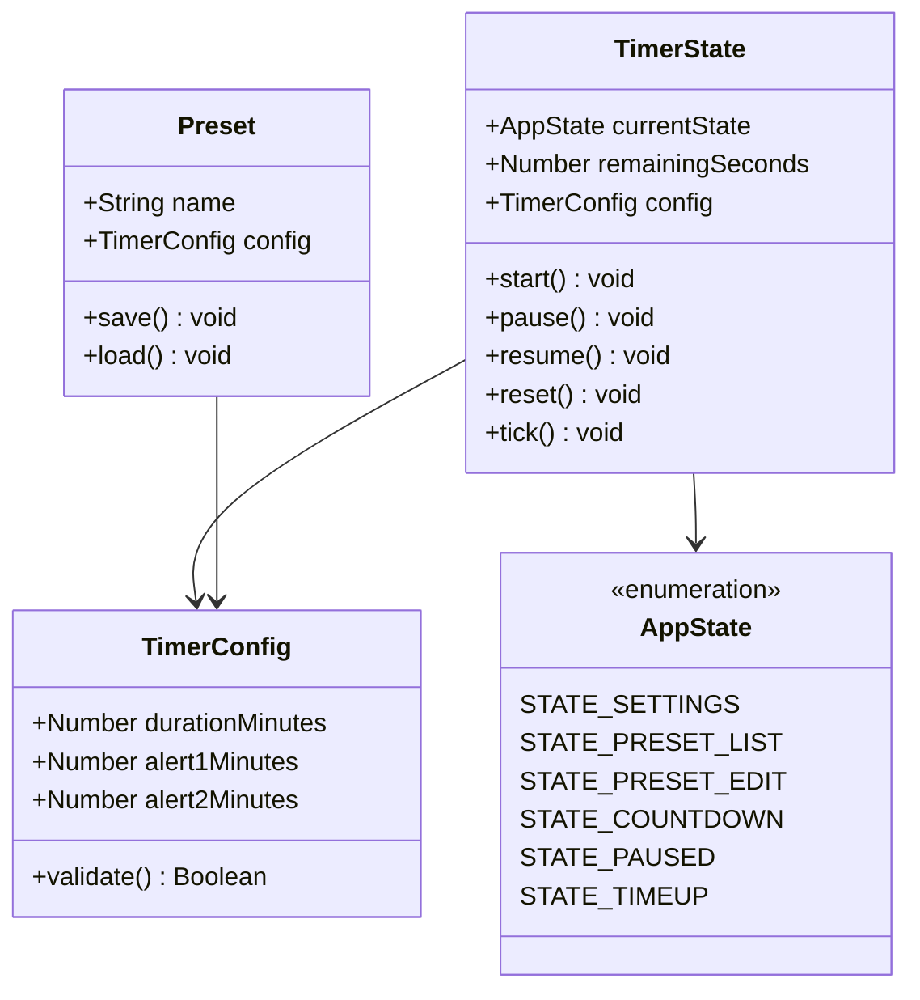
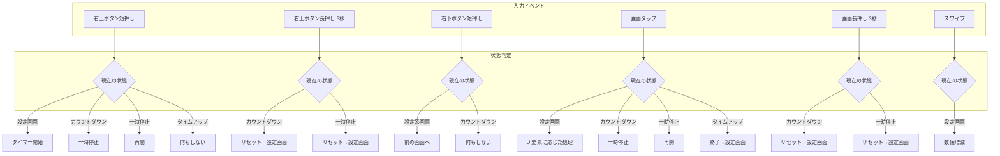
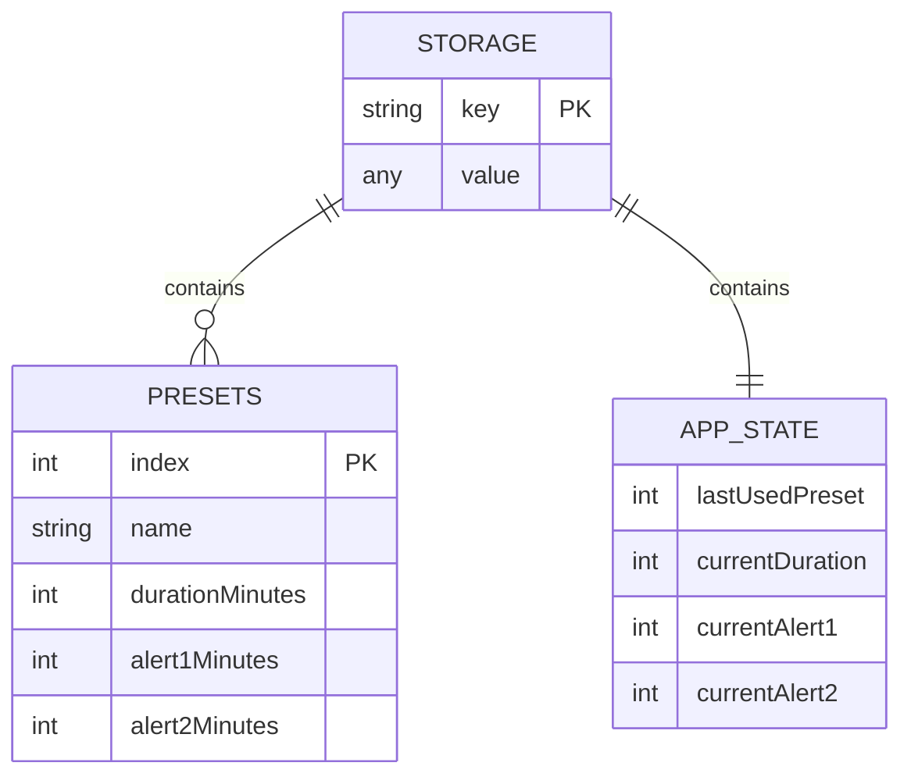
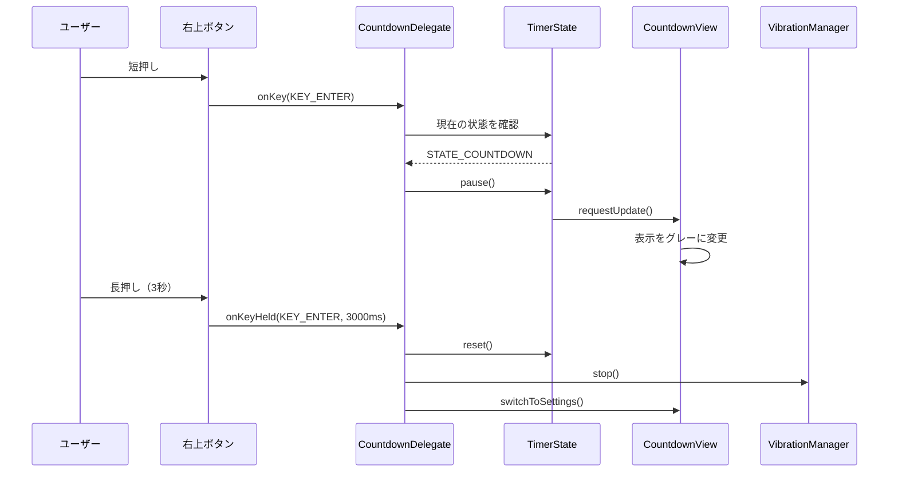
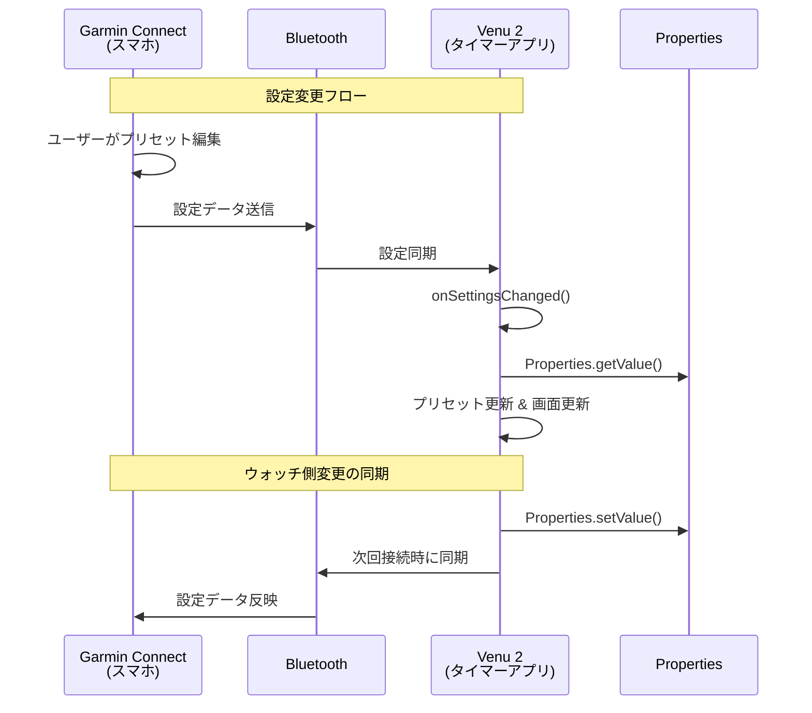
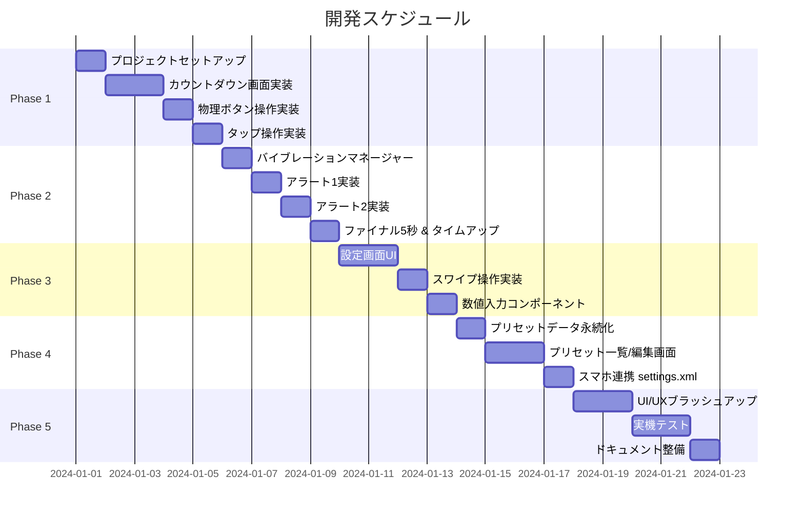

# Stage Timer 設計書 v3

## 1. 概要

Garmin Venu 2 向けの登壇者用カウントダウンタイマーアプリ。プレゼンテーションや講演の時間管理を、視覚的なフィードバック（色変化）と触覚的なフィードバック（バイブレーション）で支援する。

### 1.1 ターゲットデバイス

- Garmin Venu 2（Connect IQ 4.x 対応）
- タッチスクリーン + 物理ボタン2つ

### 1.2 対応デバイス方針

#### 基本方針

本アプリは **タッチスクリーン + 物理ボタン** の操作体系を持つデバイスのみを対象とする。タッチ非対応デバイス向けのフォールバック操作は実装しない。

#### 対応条件

以下のすべてを満たすデバイスを対応対象とする：

1. **Connect IQ 4.0 以上** - 使用するAPIの互換性確保
2. **タッチスクリーン搭載** - タップ、長押し、スワイプ操作に対応
3. **物理ボタン2つ以上** - アクションボタン（右上）とバックボタン（右下）

#### 対応デバイス一覧

| シリーズ | デバイス | 画面 | 備考 |
|----------|----------|------|------|
| Venu | Venu 2 / 2S / 2 Plus | AMOLED + タッチ | 主要ターゲット |
| Venu | Venu 3 / 3S | AMOLED + タッチ | |
| Venu | Venu Sq 2 | LCD + タッチ | |
| Epix | Epix Gen 2 | AMOLED + タッチ | |
| Epix | Epix Pro (各サイズ) | AMOLED + タッチ | |
| Forerunner | Forerunner 265 / 265S | AMOLED + タッチ | |
| Forerunner | Forerunner 965 | AMOLED + タッチ | |
| Fenix | Fenix 7 / 7S / 7X (タッチ対応モデル) | MIP + タッチ | |
| Fenix | Fenix 8 (各サイズ) | AMOLED + タッチ | |

※ 上記は代表的なデバイスであり、Connect IQ 4.x 以上かつタッチ対応の新デバイスは随時追加可能

#### 非対応デバイス

以下のデバイスはタッチスクリーン非搭載のため対応対象外とする：

| シリーズ | デバイス | 理由 |
|----------|----------|------|
| Forerunner | 255 / 955 / 945 など | ボタン操作のみ |
| Fenix | Fenix 6 以前 | タッチ非対応 |
| Instinct | 全モデル | タッチ非対応 |
| Enduro | 全モデル | タッチ非対応 |
| Descent | Mk2 以前 | タッチ非対応 |

#### manifest.xml での指定

```xml
<iq:products>
    <!-- Venu シリーズ -->
    <iq:product id="venu2" />
    <iq:product id="venu2s" />
    <iq:product id="venu2plus" />
    <iq:product id="venu3" />
    <iq:product id="venu3s" />
    <iq:product id="venusq2" />
    
    <!-- Epix シリーズ -->
    <iq:product id="epix2" />
    <iq:product id="epix2pro42mm" />
    <iq:product id="epix2pro47mm" />
    <iq:product id="epix2pro51mm" />
    
    <!-- Forerunner シリーズ（タッチ対応） -->
    <iq:product id="fr265" />
    <iq:product id="fr265s" />
    <iq:product id="fr965" />
    
    <!-- Fenix シリーズ（タッチ対応） -->
    <iq:product id="fenix7" />
    <iq:product id="fenix7s" />
    <iq:product id="fenix7x" />
    <iq:product id="fenix8amoled42mm" />
    <iq:product id="fenix8amoled47mm" />
    <iq:product id="fenix8amoled51mm" />
</iq:products>
```

#### 画面サイズ対応

デバイスごとに解像度が異なるため、レイアウトはリソースファイルで分離する：

```
resources/
├── layouts/
│   └── layout.xml              # デフォルトレイアウト
├── layouts-round-416x416/
│   └── layout.xml              # Venu 2 など
├── layouts-round-390x390/
│   └── layout.xml              # Venu 2S など
├── layouts-round-454x454/
│   └── layout.xml              # Venu 3, Epix など
└── layouts-round-360x360/
    └── layout.xml              # Fenix 7 など
```

### 1.3 開発環境

- Connect IQ SDK
- Monkey C 言語
- Visual Studio Code + Connect IQ 拡張機能

### 1.4 開発時の注意事項

- 一般的な開発における注意事項は、リポジトリルートの `CLAUDE.md` を参照すること
- `CLAUDE.md` にはコーディング規約、コミットルール、レビュー方針などプロジェクト共通のガイドラインを記載する

### 1.5 テスト・静的解析環境

#### ユニットテスト

Connect IQ SDK に組み込みのテストフレームワーク `Toybox.Test` を使用する。

**テスト関数の書き方**

```monkey-c
import Toybox.Test;

(:test)
function testTimerInitialValue(logger as Test.Logger) as Boolean {
    var config = new TimerConfig();
    Test.assertEqualMessage(config.durationMinutes, 15, "Default duration should be 15");
    return true;
}

(:test)
function testAlertOrder(logger as Test.Logger) as Boolean {
    var config = new TimerConfig();
    config.alert1Minutes = 5;
    config.alert2Minutes = 1;
    // alert1 > alert2 であることを確認
    Test.assert(config.alert1Minutes > config.alert2Minutes);
    return true;
}
```

**テストの実行**

```bash
# VS Code から
Monkey C: Run Tests

# コマンドラインから
monkeyc -t -f monkey.jungle -o bin/test.prg -d venu2_sim
connectiq && monkeydo bin/test.prg venu2_sim
```

**テストファイル配置**

```
src/
├── models/
│   └── TimerConfig.mc
└── test/
    ├── TimerConfigTest.mc
    ├── VibrationManagerTest.mc
    └── PresetTest.mc
```

#### 静的解析（型チェック）

Connect IQ SDK のコンパイラには型チェック機能（Monkey Types）が組み込まれている。

**型チェックレベル**

| レベル | オプション | 説明 |
|--------|------------|------|
| Off | `-l 0` | 型チェック無効 |
| Gradual | `-l 1` | 段階的チェック（デフォルト） |
| Informative | `-l 2` | より詳細な警告 |
| Strict | `-l 3` | 厳密な型チェック |

**推奨設定**

本プロジェクトでは **Strict（`-l 3`）** を使用し、すべての変数・関数に型アノテーションを付ける。

```monkey-c
// Good: 型アノテーションあり
var remainingSeconds as Number = 0;
function getDurationSeconds() as Number {
    return durationMinutes * 60;
}

// Bad: 型アノテーションなし
var remainingSeconds = 0;
function getDurationSeconds() {
    return durationMinutes * 60;
}
```

**monkey.jungle での設定**

```
project.typecheck = 3
project.optimization = 2
```

**VS Code 設定（.vscode/settings.json）**

```json
{
    "monkeyC.typeCheckLevel": "Strict",
    "monkeyC.compilerWarnings": true,
    "monkeyC.optimizationLevel": "2"
}
```

#### コンパイラ警告

`-w` オプションでコンパイラ警告を有効にし、すべての警告を解消してからコミットする。

```bash
# 警告を有効にしてビルド
monkeyc -w -l 3 -f monkey.jungle -o bin/app.prg -d venu2_sim
```

#### コード品質チェックリスト

| チェック項目 | 方法 | タイミング |
|--------------|------|------------|
| 型チェック | コンパイラ `-l 3` | ビルド時 |
| コンパイラ警告 | コンパイラ `-w` | ビルド時 |
| ユニットテスト | `Toybox.Test` | コミット前 |
| シミュレータ動作確認 | Connect IQ Simulator | 機能実装後 |
| 実機テスト | Venu 2 実機 | リリース前 |

#### シミュレーターを使った動作確認

Connect IQ SDK には **デバイスシミュレーター** が含まれており、PC 上で実機に近い動作確認ができる。

**シミュレーターの機能**

| 機能 | 説明 |
|------|------|
| デバイス表示 | 各デバイスの画面サイズ・形状を再現 |
| タッチ操作 | マウスクリックでタップ、ドラッグでスワイプ |
| 物理ボタン | 画面上のボタン領域をクリック |
| バイブレーション | コンソールログで確認 |
| デバッグ出力 | `System.println()` の出力を確認 |
| ブレークポイント | VS Code からステップ実行（制限あり） |
| メモリ監視 | メモリ使用量の確認 |
| プロファイリング | パフォーマンス計測 |

**シミュレーターの起動方法**

```bash
# VS Code から（推奨）
# Command Palette (Ctrl+Shift+P / Cmd+Shift+P)
# → "Monkey C: Run" または F5

# コマンドラインから
connectiq                    # シミュレーター起動
monkeydo app.prg venu2_sim   # アプリをシミュレーターで実行
```

**VS Code でのデバッグ実行**

1. F5 または「Run and Debug」でビルド＆シミュレーター起動
2. デバイス選択（例: `venu2_sim`）
3. シミュレーター上でアプリが起動

**シミュレーターでできること**

```
┌─────────────────────────────────────────────────────────────┐
│  Connect IQ Simulator                                       │
├─────────────────────────────────────────────────────────────┤
│                                                             │
│    ┌─────────────────┐                                      │
│    │                 │  ← デバイス画面                       │
│    │    12:34        │    （マウスでタップ/スワイプ操作）     │
│    │    RUNNING      │                                      │
│    │                 │                                      │
│    └─────────────────┘                                      │
│           ● ← 右上ボタン（クリック可能）                     │
│           ● ← 右下ボタン（クリック可能）                     │
│                                                             │
├─────────────────────────────────────────────────────────────┤
│  Simulation メニュー:                                        │
│  ・Time Simulation（時刻変更）                               │
│  ・Activity Data（アクティビティデータの模擬）               │
│  ・Trigger Vibrate（バイブ発火の確認）                       │
│  ・Low Power Mode（省電力モードテスト）                      │
│  ・Toggle Backlight（バックライト切替）                      │
└─────────────────────────────────────────────────────────────┘
```

**シミュレーターの制限事項**

| 項目 | 実機との差異 |
|------|--------------|
| バイブレーション | 実際の振動はなし（ログ出力で確認） |
| タッチ感度 | マウス操作のため感覚が異なる |
| 実行速度 | PC 性能に依存、実機より速い場合あり |
| センサーデータ | 心拍・GPS 等は模擬データを使用 |
| バッテリー | 消費電力の正確な測定は不可 |

**テストシナリオ例（登壇タイマー）**

| テスト項目 | シミュレーターでの確認方法 |
|------------|---------------------------|
| タイマー開始 | 右上ボタンクリック or 画面タップ |
| 一時停止/再開 | 画面タップ |
| リセット（長押し） | 右上ボタンを3秒以上押し続ける |
| 色変化（アラート） | 残り時間経過を待つ or 短いタイマーで確認 |
| バイブレーション | コンソールログで `Attention.vibrate()` 呼び出しを確認 |
| スワイプ操作 | マウスドラッグで上下スワイプ |

**デバッグ出力の活用**

```monkey-c
// デバッグビルドでのみ実行される出力
(:debug)
function debugLog(message as String) as Void {
    System.println(message);
}

// 使用例
debugLog("Timer started: " + remainingSeconds + " seconds");
debugLog("Vibration triggered: ALERT1");
```

**複数デバイスでのテスト**

シミュレーターで各デバイスの動作確認が可能：

```bash
# Venu 2 でテスト
monkeydo app.prg venu2_sim

# Fenix 7 でテスト（画面サイズ・形状が異なる）
monkeydo app.prg fenix7_sim

# Forerunner 265 でテスト
monkeydo app.prg fr265_sim
```

#### CI/CD（GitHub Actions）

Connect IQ 用の GitHub Action が公開されており、比較的簡単に CI を構築できる。

**利用可能なツール**

| ツール | 説明 | URL |
|--------|------|-----|
| action-connectiq-tester | GitHub Action（テスト実行） | [marketplace](https://github.com/marketplace/actions/connectiq-tester) |
| connectiq-tester | Docker イメージ | [GitHub](https://github.com/matco/connectiq-tester) |
| docker-connectiq | Docker イメージ（SDK + Eclipse） | [GitHub](https://github.com/kalemena/docker-connectiq) |

**ワークフロー例**

```yaml
# .github/workflows/build-and-test.yml
name: Build and Test

on:
  push:
    branches: [main, develop]
  pull_request:
    branches: [main]

jobs:
  test:
    runs-on: ubuntu-latest
    steps:
      - uses: actions/checkout@v4

      - name: Run unit tests
        uses: matco/action-connectiq-tester@v1
        with:
          device: venu2

  build:
    runs-on: ubuntu-latest
    needs: test
    steps:
      - uses: actions/checkout@v4

      - name: Build for multiple devices
        uses: matco/action-connectiq-tester@v1
        with:
          device: venu2
          # 他のデバイスも追加可能
```

**gh コマンド / GitHub MCP での構築支援**

| 作業 | ツール | コマンド例 |
|------|--------|------------|
| ワークフロー作成 | gh / MCP | ファイル作成・編集 |
| Secrets 設定 | gh | `gh secret set DEVELOPER_KEY < key.der` |
| ワークフロー実行 | gh | `gh workflow run build-and-test.yml` |
| 実行結果確認 | gh | `gh run list`, `gh run view` |

**セットアップ手順**

1. `.github/workflows/build-and-test.yml` を作成
2. 必要に応じて開発者キーを Secrets に登録
3. プッシュ時に自動テスト実行

既存の GitHub Action を活用することで、SDK のセットアップ作業を自分で行う必要がなく、ワークフローファイルの作成だけで CI が構築できる。

#### GitHub Actions のセキュリティ

**サードパーティ Action のリスク**

GitHub Actions はリポジトリのコードや Secrets にアクセスできるため、信頼できない Action を使うとセキュリティリスクがある。

| リスク | 説明 |
|--------|------|
| コード改ざん | リポジトリへの書き込み権限がある場合、コードを変更される可能性 |
| 機密情報窃取 | Secrets に設定した API キーや認証情報が外部に送信される可能性 |
| サプライチェーン攻撃 | Action の更新時に悪意のあるコードが混入する可能性 |

**Action の信頼性判断基準**

| チェック項目 | 確認方法 |
|--------------|----------|
| Verified Creator | Marketplace でバッジを確認（GitHub が身元確認済み） |
| Star 数・利用者数 | 多いほどコミュニティの監視がある |
| ソースコード公開 | 公開されていれば自分で監査可能 |
| 最終更新日 | 古すぎると互換性問題やメンテナンス放棄の可能性 |
| コード量 | 少ないほど監査が容易 |

**推奨される安全対策**

1. **ソースコードを確認する**
   - 小規模な Action は自分で読んで確認
   - 特に `entrypoint.sh` や外部通信の有無をチェック

2. **Fork して自分のリポジトリから使う**
   ```yaml
   # 他人のリポジトリを直接使う（リスクあり）
   uses: matco/action-connectiq-tester@v1

   # 自分の Fork を使う（コードを確認済み）
   uses: your-username/action-connectiq-tester@v1
   ```

3. **コミット SHA を固定する**
   ```yaml
   # タグ指定（作者が後から変更可能）
   uses: matco/action-connectiq-tester@v1

   # SHA 指定（改ざん不可）
   uses: matco/action-connectiq-tester@abc123def456789...
   ```

4. **最小権限の原則**
   ```yaml
   # ワークフローの権限を最小限に
   permissions:
     contents: read  # 読み取りのみ
   ```

5. **Docker イメージを直接使う**（Action を介さない）
   ```yaml
   jobs:
     test:
       runs-on: ubuntu-latest
       container:
         image: ghcr.io/matco/connectiq-tester:latest
       steps:
         - uses: actions/checkout@v4
         - run: /entrypoint.sh venu2
   ```

**本プロジェクトでの方針**

- `actions/checkout` など GitHub 公式 Action のみ無条件で信頼
- サードパーティ Action は **ソースコード確認後に Fork して使用**
- または Docker イメージを直接使用してAction への依存を避ける

### 1.6 セキュリティ設計

Connect IQ アプリはスマートウォッチ上で動作し、健康データやスマートフォンとの通信が可能なため、セキュリティを考慮した設計が重要。

#### 過去に発見された脆弱性

2022年にセキュリティ研究者により Connect IQ API プラットフォームに **13の脆弱性** が発見された。これらはパーミッションのバイパスやウォッチの侵害につながる可能性があった。Garmin はこれらに対処済みだが、開発者としてもセキュリティを意識する必要がある。

#### Connect IQ のパーミッションシステム

アプリが使用する機能は `manifest.xml` で明示的に宣言する必要があり、ユーザーはインストール前に確認できる。

**主なパーミッション**

| パーミッション | アクセスできるデータ/機能 | リスクレベル |
|----------------|---------------------------|--------------|
| `Communications` | インターネット通信、スマホ連携 | 高 |
| `Sensor` | 心拍センサー、加速度センサー | 中 |
| `UserProfile` | ユーザーの身体情報（年齢、体重等） | 中 |
| `Positioning` | GPS 位置情報 | 高 |
| `SensorHistory` | 過去のセンサーデータ | 中 |
| `Background` | バックグラウンド実行 | 中 |
| `FitContributor` | FIT ファイルへのデータ記録 | 低 |

#### 本アプリの最小権限設計

**登壇タイマーアプリで必要なパーミッション：なし**

```xml
<!-- manifest.xml -->
<iq:permissions>
    <!-- 本アプリは外部通信やセンサーを使用しないため、
         パーミッションを一切要求しない -->
</iq:permissions>
```

**使用しない機能（意図的に除外）**

| 機能 | 理由 |
|------|------|
| インターネット通信 | タイマー機能に不要、データ漏洩リスク回避 |
| 心拍センサー | タイマー機能に不要 |
| GPS | タイマー機能に不要、位置情報漏洩リスク回避 |
| ユーザープロファイル | タイマー機能に不要 |
| Bluetooth 通信 | タイマー機能に不要 |

#### セキュリティ上の設計方針

**1. 最小権限の原則**

```
必要最小限のパーミッションのみ要求
→ 本アプリはパーミッション不要で動作
→ ユーザーは安心してインストール可能
```

**2. データの分離**

- Connect IQ アプリは他のアプリのデータにアクセス不可
- 本アプリのプリセットデータは `Application.Storage` に保存
- ウォッチ内のローカルストレージのみ使用

**3. 外部通信の排除**

```
Communications パーミッションを使用しない
→ 外部サーバーへのデータ送信は一切なし
→ ネットワーク経由の攻撃ベクトルを排除
```

**4. スマートフォン連携の安全性**

Settings API を使用したスマホ連携は Garmin の公式機能：
- Garmin Connect アプリ経由の設定同期のみ
- 独自の通信プロトコルは使用しない
- 開発者が直接データを受信することはない

#### ユーザー向け安全性の説明

Connect IQ Store でのアプリ説明に以下を明記：

```
【プライバシーとセキュリティ】
• インターネット接続は使用しません
• 心拍数・GPS 等のセンサーデータにアクセスしません
• 個人情報の収集・送信は一切行いません
• プリセット設定はウォッチ内にのみ保存されます
```

#### 開発時のセキュリティチェックリスト

| チェック項目 | 確認内容 |
|--------------|----------|
| パーミッション最小化 | 不要なパーミッションを要求していないか |
| ハードコード回避 | API キーやシークレットをコードに含めていないか |
| 入力検証 | 設定値の範囲チェックを行っているか |
| エラーハンドリング | 例外時に機密情報を露出しないか |
| ログ出力 | 本番ビルドでデバッグログを無効化しているか |

#### Connect IQ Store レビュー

アプリ公開時に Garmin によるレビューが行われる：
- パーミッションの適切性
- 悪意のあるコードの有無
- プライバシーポリシーの確認

これにより、Store 経由でインストールされるアプリは一定の安全性が担保される。

#### 参考リンク

- [Connect IQ Security](https://developer.garmin.com/connect-iq/core-topics/security/)
- [Manifest and Permissions](https://developer.garmin.com/connect-iq/core-topics/manifest-and-permissions/)
- [Garmin セキュリティ設定ガイド（Kaspersky）](https://www.kaspersky.com/blog/garmin-privacy-settings/53920/)

---

## 2. 操作体系

### 2.1 Venu 2 の入力デバイス

```
        ┌─────────────────────┐
        │                     │
        │                     │
        │    タッチスクリーン    │ ──── タップ / 長押し / スワイプ
        │      (AMOLED)       │
        │                     │
        │                     │
        └─────────────────────┘
                              ● ─── 右上ボタン（アクションボタン）
                              
                              ● ─── 右下ボタン（バックボタン）
```

### 2.2 操作の役割分担

#### 物理ボタン操作

| ボタン | 操作 | 機能 | 使用場面 |
|--------|------|------|----------|
| 右上（アクション） | 短押し | タイマー開始 / 一時停止 / 再開 | 全画面共通 |
| 右上（アクション） | 長押し（3秒） | リセット → 設定画面へ | カウントダウン中・一時停止中 |
| 右下（バック） | 短押し | 前の画面に戻る / キャンセル | 設定系画面 |
| 右下（バック） | 長押し | アプリ終了 | 全画面共通 |

#### タッチスクリーン操作

| 操作 | 機能 | 使用場面 |
|------|------|----------|
| タップ | UI要素の選択・決定 | 設定画面のボタン・リスト |
| タップ | 一時停止 / 再開（ボタンと同等） | カウントダウン中 |
| タップ | タイムアップ解除 → 設定画面へ | タイムアップ画面 |
| 長押し（3秒） | リセット → 設定画面へ | カウントダウン中・一時停止中 |
| 上下スワイプ | 数値の増減 | 時間設定時 |
| 左右スワイプ | 設定項目の切り替え | 設定画面 |

### 2.3 操作の設計思想

```
┌────────────────────────────────────────────────────────────────┐
│                        操作の優先度                             │
├────────────────────────────────────────────────────────────────┤
│                                                                │
│  【物理ボタン】= 確実な操作（登壇中、画面を見ずに操作）           │
│    ・タイマー開始/停止 → 右上ボタン                             │
│    ・リセット → 右上ボタン長押し                                │
│    ・戻る → 右下ボタン                                         │
│                                                                │
│  【タッチ】= 直感的な操作（設定時、画面を見ながら操作）           │
│    ・UI要素の選択 → タップ                                     │
│    ・数値調整 → スワイプ                                       │
│    ・タイマー操作も可能（物理ボタンと同等）                      │
│                                                                │
└────────────────────────────────────────────────────────────────┘
```

---

## 3. 機能要件

### 3.1 タイマー基本機能

| ID | 要件 | 詳細 | 操作方法 |
|----|------|------|----------|
| F-01 | 時間設定 | 分単位で設定可能（1〜90分） | タッチ：スワイプ/タップ |
| F-02 | カウントダウン表示 | 残り時間を MM:SS 形式で表示 | - |
| F-03 | 開始 | タイマーを開始する | ボタン：右上 / タッチ：STARTタップ |
| F-04 | 一時停止 | カウントダウンを一時停止 | ボタン：右上 / タッチ：画面タップ |
| F-05 | 再開 | 一時停止から再開 | ボタン：右上 / タッチ：画面タップ |
| F-06 | リセット | 設定画面に戻る | ボタン：右上長押し / タッチ：画面長押し |

### 3.2 アラート機能

| ID | 要件 | 詳細 |
|----|------|------|
| F-07 | 第1アラート | 設定残り時間（多い方）到達時に黄色表示 + 1秒バイブレーション |
| F-08 | 第2アラート | 設定残り時間（少ない方）到達時にマゼンタ表示 + 0.5秒バイブ×4回 |
| F-09 | ファイナルカウント | 残り5,4,3,2,1秒で各1回短いバイブレーション |
| F-10 | タイムアップ | 00:00で白背景「Time Up!」表示 + バイブ点滅継続 |
| F-11 | タイムアップ解除 | タップで設定画面に戻りバイブ停止 |

### 3.3 設定・プリセット機能

| ID | 要件 | 詳細 | 操作方法 |
|----|------|------|----------|
| F-12 | タイマー長設定 | 1〜90分の範囲で設定 | タッチ：スワイプで増減 |
| F-13 | アラート時間設定 | 2つのアラート残り時間を設定 | タッチ：スワイプで増減 |
| F-14 | プリセット保存 | 最大5つのプリセットを保存 | タッチ：保存ボタンタップ |
| F-15 | プリセット読込 | 保存済みプリセットを選択 | タッチ：リストからタップ |
| F-16 | プリセット名編集 | 各プリセットに名前を付ける | スマホ：Garmin Connect から |
| F-17 | 戻る | 前の画面に戻る | ボタン：右下 |

---

## 4. 画面設計

### 4.1 画面遷移図



### 4.2 カウントダウン画面の状態遷移



### 4.3 設定画面レイアウト

```
┌─────────────────────────────┐
│   ⏱ 登壇タイマー             │
├─────────────────────────────┤
│                             │
│  タイマー   ▲               │ ← 【上スワイプ】で増加
│            15 分            │
│            ▼               │ ← 【下スワイプ】で減少
│                             │
│  アラート1  [ 5分前 ]        │ ← 【タップ】で編集モード
│  アラート2  [ 1分前 ]        │ ← 【タップ】で編集モード
│                             │
├─────────────────────────────┤
│  📋 [LT 15分]  ▼            │ ← 【タップ】でプリセット一覧
├─────────────────────────────┤
│                             │
│      [ ▶ START ]            │ ← 【タップ】or【右上ボタン】
│                             │
│  ← 戻る: 右下ボタン          │
└─────────────────────────────┘
```

### 4.4 カウントダウン画面レイアウト

```
┌─────────────────────────────┐
│                             │
│                             │
│         12:34               │ ← 残り時間（大フォント）
│                             │
│         ▶ RUNNING           │ ← ステータス
│                             │
│  ─────────────────────────  │
│  ⏸ タップで一時停止          │ ← 操作ヒント
│  🔄 長押しでリセット          │
│                             │
└─────────────────────────────┘

操作:
  【右上ボタン】    → 一時停止/再開
  【画面タップ】    → 一時停止/再開
  【右上ボタン長押し】→ リセット（設定画面へ）
  【画面長押し3秒】  → リセット（設定画面へ）
```

### 4.5 タイムアップ画面レイアウト

```
┌─────────────────────────────┐
│█████████████████████████████│
│█████████████████████████████│
│█████████████████████████████│
│█████  Time Up!  ████████████│ ← 黒文字 / 白背景
│█████████████████████████████│
│█████████████████████████████│
│█████  タップして終了  ███████│ ← 操作ヒント
│█████████████████████████████│
└─────────────────────────────┘

操作:
  【画面タップ】→ バイブ停止 & 設定画面へ
```

### 4.6 表示色の状態

| 状態 | 文字色 | 背景色 | 備考 |
|------|--------|--------|------|
| 通常 | 白 | 黒 | デフォルト |
| 一時停止 | グレー | 黒 | 停止中を視覚的に表現 |
| アラート1 | 黄色 | 黒 | 残り時間注意 |
| アラート2 | マゼンタ | 黒 | 終了間近 |
| タイムアップ | 黒 | 白 | 反転で目立たせる |

---

## 5. 操作フロー詳細

### 5.1 基本操作フロー



### 5.2 登壇中の典型的な操作シナリオ

```
【登壇前】スマホ または ウォッチで設定
    │
    ▼
【登壇開始】右上ボタンを押してスタート ← 画面を見なくてOK
    │
    ▼
【講演中】時計をチラ見して残り時間確認
    │      バイブで残り時間を体感
    │
    ├──【中断が必要】→ 右上ボタンで一時停止
    │                   右上ボタンで再開
    │
    ├──【やり直し】→ 右上ボタン3秒長押しでリセット
    │
    ▼
【終了】タイムアップ → 画面タップで終了
```

---

## 6. バイブレーションパターン設計

### 6.1 パターン定義

| イベント | パターン | 詳細 |
|----------|----------|------|
| アラート1 | 長振動1回 | 1000ms ON |
| アラート2 | 点滅4回 | 500ms ON → 500ms OFF × 4セット |
| ファイナル5秒 | 短振動1回/秒 | 100ms ON（残り5,4,3,2,1秒で各1回） |
| タイムアップ | 連続点滅 | 300ms ON → 300ms OFF（タップまで継続） |

### 6.2 タイムライン図



※ 上図は概念図です。実際の Mermaid Gantt は時間単位の制約があるため、秒単位の表現は近似的です。

### 6.3 バイブレーションシーケンス（テキスト版）

```
時間軸 (残り時間)        バイブレーション
───────────────────────────────────────
15:00  スタート
  │
  │    （通常：バイブなし）
  │
05:00  ★ アラート1 ━━━━━━━━━━ [1000ms ON]
  │
  │    （アラート1状態：バイブなし）
  │
01:00  ★ アラート2 ━━━━ [500ms] ─ [500ms] ─ [500ms] ─ [500ms]
  │                   ON      OFF     ON      OFF ...×4
  │
00:05  ★ ━ [100ms]
00:04  ★ ━ [100ms]
00:03  ★ ━ [100ms]
00:02  ★ ━ [100ms]
00:01  ★ ━ [100ms]
  │
00:00  ★ タイムアップ ━━ [300ms] ─ ━━ [300ms] ─ ━━ ...
                       ON       OFF    ON      (継続)
```

---

## 7. 状態管理設計

### 7.1 アプリケーション状態



### 7.2 入力イベント処理



---

## 8. データ永続化

### 8.1 保存データ構造



### 8.2 デフォルトプリセット

| # | 名前 | 時間 | アラート1 | アラート2 |
|---|------|------|-----------|-----------|
| 1 | LT 5分 | 5分 | 1分前 | 30秒前 |
| 2 | LT 10分 | 10分 | 3分前 | 1分前 |
| 3 | LT 15分 | 15分 | 5分前 | 1分前 |
| 4 | セッション30 | 30分 | 10分前 | 5分前 |
| 5 | 基調講演60 | 60分 | 15分前 | 5分前 |

---

## 9. 技術設計

### 9.1 クラス構成

```
src/
├── StageTimerApp.mc             // アプリケーションエントリ
├── StageTimerDelegate.mc        // 入力イベントハンドラ
│
├── views/
│   ├── SettingsView.mc          // 設定画面
│   ├── CountdownView.mc         // カウントダウン画面
│   ├── TimeUpView.mc            // タイムアップ画面
│   ├── PresetListView.mc        // プリセット一覧
│   └── PresetEditView.mc        // プリセット編集
│
├── delegates/
│   ├── SettingsDelegate.mc      // 設定画面の入力処理
│   ├── CountdownDelegate.mc     // カウントダウン画面の入力処理
│   └── TimeUpDelegate.mc        // タイムアップ画面の入力処理
│
├── models/
│   ├── TimerConfig.mc           // タイマー設定モデル
│   ├── Preset.mc                // プリセットモデル
│   └── TimerState.mc            // タイマー状態管理
│
├── utils/
│   ├── VibrationManager.mc      // バイブレーション制御
│   ├── StorageManager.mc        // データ永続化
│   └── ColorManager.mc          // 色管理ユーティリティ
│
└── resources/
    ├── strings.xml              // 文字列リソース
    ├── drawables.xml            // 描画リソース
    ├── properties.xml           // プロパティ定義
    └── settings.xml             // スマホ連携設定
```

### 9.2 Delegate パターンによる入力処理



### 9.3 省電力設計

#### 9.3.1 AMOLED ディスプレイの特性と制約

本アプリの主要ターゲットである Venu 2 をはじめとする AMOLED デバイスには、以下の特性がある：

| 特性 | 説明 | 開発者への影響 |
|------|------|----------------|
| ピクセル単位の発光 | 各ピクセルが個別に発光するため、黒は電力消費ゼロ | 黒背景を基本とすることで省電力化 |
| バーンイン防止 | 同じピクセルを長時間点灯すると焼き付きが発生 | システムが自動的に減光・画面OFF |
| 画面タイムアウト | 一定時間（数秒〜十数秒）で自動的に減光/OFF | 開発者側で完全な制御は不可 |
| ジェスチャー復帰 | 手首を上げると画面が復帰 | Watch App では検知 API なし |

#### 9.3.2 API の制約

**Watch App で使用できない機能**

| 機能 | 制約 | 代替手段 |
|------|------|----------|
| `onEnterSleep()` / `onExitSleep()` | WatchFace 専用、Watch App では使用不可 | なし |
| 手首ジェスチャー検知 | API が存在しない | システム任せ（ユーザーが手首を見れば復帰） |
| 画面常時ON | AMOLED では不可（バーンイン防止） | バイブレーションで補完 |

**Watch App で使用できる機能**

| 機能 | API | 制約 |
|------|-----|------|
| バックライト制御 | `Attention.backlight()` | 約1分以上の連続ONで例外発生 |
| バイブレーション | `Attention.vibrate()` | 制限なし（本アプリの主要通知手段） |

#### 9.3.3 省電力設計方針

本アプリでは「**画面が消えることを前提**」とした設計を採用する。

```
┌────────────────────────────────────────────────────────────────┐
│                    省電力設計の基本方針                          │
├────────────────────────────────────────────────────────────────┤
│                                                                │
│  1. 画面表示の最適化                                            │
│     ・黒背景 + 最小限の白/カラー文字で電力消費を最小化            │
│     ・点灯ピクセル数を必要最小限に抑える                         │
│                                                                │
│  2. システムの画面制御を受け入れる                               │
│     ・画面タイムアウトはシステム設定に従う（開発者は制御不可）     │
│     ・手首ジェスチャーでの自動復帰を前提とする                   │
│                                                                │
│  3. バイブレーションによる確実な通知                             │
│     ・画面を見ていなくても時間経過を体感できる                   │
│     ・アラート1, 2, ファイナル5秒で確実に通知                    │
│                                                                │
│  4. ユーザー設定の案内                                          │
│     ・「アクティビティ中のAOD」をONにすることを推奨               │
│                                                                │
└────────────────────────────────────────────────────────────────┘
```

#### 9.3.4 画面表示の電力最適化

**カラーパレット設計**

| 状態 | 文字色 | 背景色 | 点灯ピクセル比率（目安） |
|------|--------|--------|--------------------------|
| 通常 | 白 | 黒 | 約 5-8% |
| 一時停止 | グレー | 黒 | 約 3-5%（より省電力） |
| アラート1 | 黄色 | 黒 | 約 5-8% |
| アラート2 | マゼンタ | 黒 | 約 5-8% |
| タイムアップ | 黒 | 白 | 約 90%（短時間のみ許容） |

**表示要素の最適化**

```monkey-c
// 省電力を意識した描画
function onUpdate(dc as Dc) as Void {
    // 背景を黒でクリア（AMOLED では電力消費ゼロ）
    dc.setColor(Graphics.COLOR_BLACK, Graphics.COLOR_BLACK);
    dc.clear();
    
    // 必要最小限の情報のみ表示
    dc.setColor(Graphics.COLOR_WHITE, Graphics.COLOR_TRANSPARENT);
    
    // 大きな時間表示（視認性重視、細めのフォントで省電力）
    dc.drawText(
        width / 2,
        height / 2,
        Graphics.FONT_NUMBER_MILD,  // 細めのフォントを選択
        formatTime(remainingSeconds),
        Graphics.TEXT_JUSTIFY_CENTER | Graphics.TEXT_JUSTIFY_VCENTER
    );
}
```

#### 9.3.5 バイブレーションによる補完

画面が見えない状況でもタイマーの状態を把握できるよう、バイブレーションパターンを設計済み（セクション6参照）。

**バイブレーションの役割**

| タイミング | パターン | 意味（ユーザーが体感で理解） |
|------------|----------|------------------------------|
| アラート1 | 長振動1回 | 「そろそろ残り時間少ない」 |
| アラート2 | 点滅4回 | 「もうすぐ終わり！」 |
| ファイナル5秒 | 毎秒短振動 | カウントダウン体感 |
| タイムアップ | 連続点滅 | 「時間です！」 |

#### 9.3.6 ユーザーへの案内

アプリの README および Connect IQ Store の説明文に以下を記載：

```markdown
## 推奨設定

登壇中にタイマーを常に表示したい場合は、以下の設定をお勧めします：

1. ウォッチの設定アプリを開く
2. 「システム」→「ディスプレイ」を選択
3. 「アクティビティ中」の「常時表示（AOD）」を **ON** に設定

※ この設定により、タイマー動作中も画面が減光状態で表示され続けます
※ バッテリー消費は増加しますが、登壇時間（数十分〜1時間程度）であれば
   実用上問題ありません

## 画面が消えても安心

本アプリはバイブレーションによる通知を重視して設計されています。
画面を見ていなくても、振動パターンで残り時間を把握できます：

- 長い振動1回 → 第1アラート（例：残り5分）
- 短い振動4回 → 第2アラート（例：残り1分）
- 毎秒振動 → 残り5秒からのカウントダウン
- 連続振動 → タイムアップ！
```

#### 9.3.7 実装上の注意点

**バックライト制御の安全な使用**

```monkey-c
// バックライト更新（例外をキャッチ）
function refreshBacklight() as Void {
    if (Attention has :backlight) {
        try {
            Attention.backlight(true);
        } catch (ex instanceof Attention.BacklightOnTooLongException) {
            // AMOLED デバイスで長時間連続ONを試みた場合
            // → 無視してシステムに任せる
        } catch (ex) {
            // その他の例外も握りつぶす
        }
    }
}
```

**タイマー Tick 時の処理**

```monkey-c
function onTimerTick() as Void {
    remainingSeconds -= 1;
    
    // 画面更新をリクエスト（システムが適切なタイミングで描画）
    WatchUi.requestUpdate();
    
    // アラート判定とバイブレーション
    checkAndTriggerAlerts();
    
    // 注意: バックライト更新は頻繁に呼ばない
    // システムの画面制御に任せる
}
```

#### 9.3.8 電力消費の目安

| シナリオ | 推定消費 | 備考 |
|----------|----------|------|
| 15分タイマー（AOD OFF） | 約 1-2% | 画面OFF時間が長い |
| 15分タイマー（AOD ON） | 約 3-5% | 減光表示が継続 |
| 60分タイマー（AOD ON） | 約 10-15% | 長時間使用 |

※ 上記は目安であり、デバイスの状態や他のアプリの影響で変動する

#### 9.3.9 MIP ディスプレイ搭載デバイスでの動作

Fenix 7 シリーズなど MIP ディスプレイ搭載デバイスでは、AMOLED とは異なる特性がある：

| 特性 | MIP | AMOLED |
|------|-----|--------|
| バックライト常時ON | 可能（設定で変更可） | 不可（バーンイン防止） |
| 省電力性 | バックライトOFFで非常に省電力 | 黒背景で省電力 |
| 屋外視認性 | 優秀（反射型） | 要フル輝度 |

本アプリは両方のディスプレイタイプで適切に動作するよう、共通の省電力設計を採用している。

---

## 10. スマートフォン連携設計

### 10.1 概要

Connect IQ の **Settings API** を使用し、Garmin Connect モバイルアプリからプリセットの設定・編集を可能にする。

### 10.2 連携フロー



### 10.3 Garmin Connect での設定画面

```
┌─────────────────────────────────────┐
│ ← 登壇タイマー 設定                  │
├─────────────────────────────────────┤
│                                     │
│ ▼ プリセット 1                       │
│   名前           [LT 5分         ]  │ ← テキスト入力
│   タイマー時間    [5] 分             │ ← 数値スライダー
│   アラート1      [1] 分前           │ ← 数値スライダー
│   アラート2      [0.5] 分前         │ ← 数値スライダー
│                                     │
│ ▼ プリセット 2                       │
│   ...                               │
│                                     │
│ ─────────────────────────────────── │
│ 起動時のプリセット  [プリセット 3 ▼]  │ ← ドロップダウン
└─────────────────────────────────────┘

※ プリセット名の編集はスマホからのみ可能
  （ウォッチでの文字入力は煩雑なため）
```

---

## 11. 開発計画

### 11.1 フェーズ分け



### 11.2 各フェーズの詳細

#### Phase 1: 基本機能（5日）

| タスク | 操作種別 | 詳細 |
|--------|----------|------|
| プロジェクトセットアップ | - | SDK, マニフェスト設定 |
| カウントダウン画面 | - | 残り時間表示、状態管理 |
| 右上ボタン：開始/停止 | 物理ボタン | `onKey(KEY_ENTER)` |
| 右上ボタン：長押しリセット | 物理ボタン | `onKeyHeld()` 3秒判定 |
| 画面タップ：一時停止 | タッチ | `onTap()` |
| 画面長押し：リセット | タッチ | `onHold()` 3秒判定 |

#### Phase 2: アラート機能（4日）

| タスク | 詳細 |
|--------|------|
| VibrationManager | パターン定義、実行制御 |
| アラート1 | 色変更 + 1秒バイブ |
| アラート2 | 色変更 + 0.5秒×4バイブ |
| ファイナル5秒 | 毎秒短バイブ |
| タイムアップ画面 | 白背景 + 連続バイブ + タップ終了 |

#### Phase 3: 設定画面（4日）

| タスク | 操作種別 | 詳細 |
|--------|----------|------|
| 設定画面レイアウト | - | 時間・アラート表示 |
| 上下スワイプ | タッチ | 数値増減 |
| 左右スワイプ | タッチ | 設定項目切り替え |
| STARTボタン | タッチ/物理 | タイマー開始 |
| 右下ボタン：戻る | 物理ボタン | 画面遷移 |

#### Phase 4: プリセット機能（4日）

| タスク | 詳細 |
|--------|------|
| StorageManager | `Application.Storage` ラッパー |
| プリセット一覧画面 | リスト表示、タップ選択 |
| プリセット保存/読込 | データ永続化 |
| settings.xml | スマホ連携設定定義 |
| onSettingsChanged | 同期ハンドラ |

#### Phase 5: 仕上げ（5日）

| タスク | 詳細 |
|--------|------|
| UI調整 | フォント、色、レイアウト最適化 |
| 操作ヒント表示 | ボタン/タッチの使い分けガイド |
| エッジケーステスト | 境界値、長時間動作 |
| 実機テスト | 登壇シミュレーション |

### 11.3 テスト項目

| カテゴリ | テスト内容 | 操作種別 |
|----------|------------|----------|
| 基本動作 | 右上ボタンで開始/停止 | 物理ボタン |
| 基本動作 | 画面タップで開始/停止 | タッチ |
| 基本動作 | 右上ボタン長押しでリセット | 物理ボタン |
| 基本動作 | 画面長押しでリセット | タッチ |
| 設定 | スワイプで数値変更 | タッチ |
| 設定 | 右下ボタンで戻る | 物理ボタン |
| アラート | 各アラートの発火タイミング | - |
| バイブ | 各パターンの動作確認 | - |
| 連携 | スマホ→ウォッチ同期 | - |
| 連携 | ウォッチ→スマホ同期 | - |

---

## 12. 今後の拡張案

- セッション履歴の記録
- 複数タイマーの連続実行（セッション + 休憩）
- カスタムバイブレーションパターン
- 経過時間モード（カウントアップ）の追加
- ウィジェット版（クイックアクセス用）

---

## 13. 参考リソース

- [Connect IQ SDK ドキュメント](https://developer.garmin.com/connect-iq/overview/)
- [Monkey C API リファレンス](https://developer.garmin.com/connect-iq/api-docs/)
- [Venu 2 デバイス仕様](https://developer.garmin.com/connect-iq/compatible-devices/)
- [Attention モジュール（バイブレーション）](https://developer.garmin.com/connect-iq/api-docs/Toybox/Attention.html)
- [Input Handling ガイド](https://developer.garmin.com/connect-iq/core-topics/input-handling/)
- [Settings API](https://developer.garmin.com/connect-iq/core-topics/properties-and-app-settings/)
- [AMOLED ウォッチフェイス開発ガイド](https://developer.garmin.com/connect-iq/connect-iq-faq/how-do-i-make-a-watch-face-for-amoled-products/)
- [Watch Face Low- and High-Power Modes](https://forums.garmin.com/developer/connect-iq/b/news-announcements/posts/changes-to-watch-face-low--and-high-power-modes)
